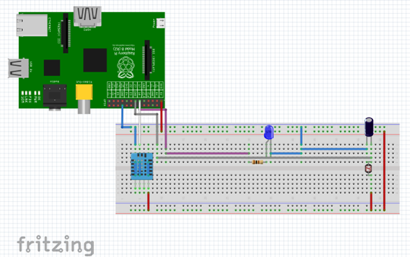
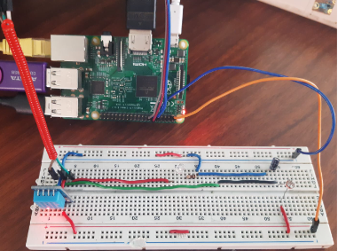

# ConnectIoT-Eden Prototype

Eden is a Mexbalia product that creates the perfect environment for plants to thrive, it is an educational project and an ally in the care and growth of plants. On the other hand, ConnectIot´s purpose is to register IoT devices and their data in the NEAR blockchain, so with this in mind, this test tries to combine an Eden prototype with the ConnectIoT platform. 
<center>


</center>

## Test
The test was done with a Raspberry Pi 2 B, a DHT11 module, for temperature and humidity, and an LDR (Light Dependant Resistor) for light intensity measurement.  The only difference between the DHT11 sensor and the DHT11 module is that the module will have a filtering capacitor and pull-up resistor inbuilt, and for the sensor alone, they have to be used externally if required, like in the LDR setup.


## Circuit

There are three pins for communication between components and the Raspberry PI. The DHT11 module is to GPIO17, and the LDR sensor is to GPIO27. The third one is for a LED to indicate day and night, which is to GPIO18. The LDR and the DHT11 work with a 3.3 V power supply.

<center>



</center>

## Code

Using the [ConnectIoT-py](https://github.com/paul-cruz/ConnectIoT-py), AdafruitDHT11, gpiozero and other libraries we can start taking in data from our sensors and send it to the NEAR blockchain.

```py
import datetime
import time
import Adafruit_DHT 
from Adafruit_DHT.common import DHT11
import os
from gpiozero import LightSensor, LED
from ConnectIoT import ConnectIoT 
```

Setting pins and LED when light or dark
```py
# Connecting LDR to pin GPIO27 & LED to GPIO18
ldr=LightSensor(27)
led=LED(18)
ldr.when_dark=led.on
ldr.when_light=led.off
# DHT sensor connected to GPIO17.
dht11 = Adafruit_DHT.DHT11
pinDHT11 = 17
```

Connecting to the [ConnectIoT-API](https://github.com/paul-cruz/ConnectIoT-API) by adding environment variables:

- NEAR_ACCOUNT_ID (*Account signing contract*)
- NEAR_CONTRACT_URL (*URL in which the API is running*)
- NEAR_PRIVATE_KEY (*Signing account private key*)

Using the ConnectIot library the [create_registry](https://github.com/paul-cruz/ConnectIoT-py/blob/main/docs/CREATEREG.md#create-a-registry) and the [add_device_to_registry](https://github.com/paul-cruz/ConnectIoT-py/blob/main/docs/ADDDEVICE.md#add-device-to-registry) functions are called

```py
contract = ConnectIoT(
                          os.environ.get('NEAR_CONTRACT_URL'),
                          os.environ.get('NEAR_ACCOUNT_ID'),
                          os.environ.get('NEAR_PRIVATE_KEY'))
        print('API URL: '+contract.contract_api_url)
        
        registry_name = 'EdenTest_1.0'
        device_name = 'DHT11 & LDR'

        new_registry=contract.create_registry(registry_name)
        new_device = contract.add_device_to_registry(
                registry_name, device_name, 'Device DHT11 & LDR for python lib test.')
       
        print("New Registry: "+registry_name+" created")
        print("New Device: "+device_name+", added to: "+registry_name)
```
Inside a while loop, the timenow variable is created using the Datetime library, temperature and humidity values are read from the DHT11 using the Adafruit library, and the light percentage is gotten using the gpiozero LightSensor value. 

Once the variables are set, the code checks if none of them have a None value. If not, the code prints the first sampling, this is where the code calls the [set_device_data](https://github.com/paul-cruz/ConnectIoT-py/blob/main/docs/SETDEVDATA.md#set-data-to-a-device) function, for it to then print the [get_device_data](https://github.com/paul-cruz/ConnectIoT-py/blob/main/docs/GETDEVDATA.md#get-data-from-device) function, meaning that the relative temperature in celsius, humidity percentage, and light percentage of somewhere has been registered in the NEAR blockchain.
Whatever else happens the code calls the [delete_device_from_registry](https://github.com/paul-cruz/ConnectIoT-py/blob/main/docs/DELDEVICE.md#delete-a-device-from-a-registry) and the [delete_registry](https://github.com/paul-cruz/ConnectIoT-py/blob/main/docs/DELETEREG.md#delete-a-registry) functions and terminates the program.
```py
timenow = datetime.datetime.now()
        humidity, temperature = Adafruit_DHT.read_retry(dht11, pinDHT11)
        light=round(ldr.value*100,2)
    
        if humidity is not None and temperature is not None and light is not None:
            print('Temperature={0:0.1f}*C  Humidity={1:0.1f}%  Light={2:0.1f}%'.format(temperature, humidity,light))

            contract.set_device_data(registry_name, device_name, {
                'Date': timenow, 'Temperature C°': temperature, 'Humidity %': humidity,'Light %': light,})
            print(contract.get_device_data(registry_name, device_name))
                      
        else:
            print('Failed to get reading. Try again!') 
            if contract.delete_device_from_registry(registry_name, device_name):
                contract.delete_registry(registry_name)
                
                print('Device and Registry deleted!') 
                break
```
If everything is connected right you should see something like this on the terminal.

<center>


</center>

Your circuit should look and perform like this:
<center>



</center>

<center>


</center>

If you have any doubts please watch this [video]() and check the [code here.](code/DHT11Eden.py)