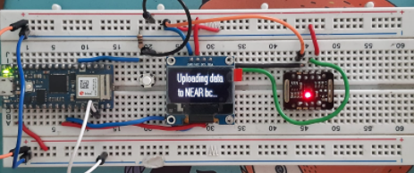

# ConnectIoT-Oximeter Prototype
Due to the Covid-19 pandemic, Mexbalia designed and developed an Oximeter that connects to the Cloud through an app. This small non-invasive fingertip device can provide valuable health information; on how oxygen saturation in blood and pulse rate behave during a mild episode of COVID-19 or any other respiratory illness or event. Aimed at: patients with covid-19 initially classified as mild cases and with risk factors.

<p align="center">
  
</p>

## Test
The test was done with an Arduino Nano 33 IoT, a MAX30102 High-Sensitivity Pulse Oximeter, and Heart-Rate Biosensor for Fitness & Healthcare, a White 0.96” 128x64 OLED LCD Display, a 100 ohm resistor, a push button, and wires. Using the Arduino Nano 33 IoT and the required libraries the sensor and display are put to work, then connected to the [ConnectIoT-API](https://github.com/paul-cruz/ConnectIoT-API) through the [ConnectIoT-ino library](https://github.com/paul-cruz/ConnectIoT-ino) and register SPO2 and heart rate data in the NEAR blockchain.

## Circuit
For this project the Arduino uses three main pins for communication, two (SDA,SCL) for I2C communication with the display and the MAX30102 and the third one (D4) as an input switch.

<p align="center">
  
</p>

## Code
Oximeters functionality code was taken from the [Oximeter repository](https://github.com/paul-cruz/OXIMETER), but the measured data is sent to the NEAR blockchain using the [ConnectIoT-ino library](https://github.com/paul-cruz/ConnectIoT-ino) instead of going to the Google Cloud Instance. 

As recommended by the ConnectIoT-ino example, there must be a SECRETS.h file in which there will be stored valuable constants such as the NEAR account id that signs the transaction, the SSID, and Password for the Arduino to connect to WiFi, the NEAR Private key and the contract URL for communicating with the [ConnectIoT-API](https://github.com/paul-cruz/ConnectIoT-API).

```c
#define SECRET_SSID "Your WiFi name"
#define SECRET_PASS "WiFi password"
#define SERVER_ADDR "IP where the API is running"
#define SERVER_PORT 5000
#define NEAR_PRIVATE_KEY "NEVER SHARE THIS KEY"
#define NEAR_ACCOUNT_ID "Your NEAR account example.testnet"
#define NEW_REGISTRY "registry_name"
#define ADD_DEVICE "device_name"
```
The Oximeter project includes several libraries for it to work properly, for this test the only library added was the [ConnectIoT-ino library](https://github.com/paul-cruz/ConnectIoT-ino).

```cpp
#include <WiFiNINA.h>
#include <ConnectIoT.h>
#include "secrets.h"
#include "MAX30105.h"
#include "spo2_algorithm.h"
#include <U8g2lib.h>
```
Two functions were added to the Oximeter code, one for creating a new registry and adding a device to it and another for setting data to the device and getting it back from the NEAR blockchain. These functions are later used in the setup function and the loop function respectively.

```cpp
bool createNewRegistryandaddDevice(){
 if (contract.createRegistry(registryName))
  {
    bool newDevice = contract.addDeviceToRegistry(
        registryName, deviceName, "Device for Arduiuno lib test.");
        return newDevice;
  
} else{ 
    Serial.println("Failed to create the registry");
    
      }
}

```
```cpp
bool setDeviceData()
{     DynamicJsonDocument req(1024);
      req["HeartRate"] = heartRate;
      req["SPO2"] = spo2;
      contract.setDeviceData(registryName, deviceName, req);
      
      Serial.println("SPO2: "+contract.getDeviceDataParam(registryName, deviceName,"SPO2"));
      Serial.println("BPM: "+contract.getDeviceDataParam(registryName, deviceName,"HeartRate"));
      req.clear();
}
```
Inside the setup function, the code connects to the WiFI using the WiFiNINA library. Once the connection is achieved a new registry is created and the new device is added to it, at the same time the input pin is set, and the display starts up and shows the Initializing screen. At this point, the code is only waiting for the input pin to send a signal through the push button in the circuit. When pressed, the oximeter starts to measure and once it is done through the loop function it connects to the [ConnectIoT Smart Contract](https://github.com/paul-cruz/ConnectIoT) and sets and gets the read data.

```cpp
void setup(){
  Serial.println("Connected to WiFi");
  createNewRegistryandaddDevice();
  pinMode(2, INPUT);
  display.begin();
  initial_display();
}

void loop(){
      if (heartRate>50 and heartRate<220 and spo2>50 and spo2<100) {
        display.clearBuffer();
        display.setFont(u8g2_font_crox2hb_tr); 
        display.setCursor(10,12);
        display.print("Uploading data");
        display.setCursor(8,29);
        display.print(" to NEAR bc...");
        display.sendBuffer();
        Serial.println("Sending request...");
        setDeviceData();
        print_data();
    }}
```
If everything is connected right your circuit should look and perform like this:
<center>


</center>

<center>


</center>
<center>



</center>
<center>


</center>

You can always check your transactions at the [NEAR Explorer](https://explorer.testnet.near.org/).
If you have any doubts please watch this [video]() and check the [code here.](code/oximeter.cpp)

